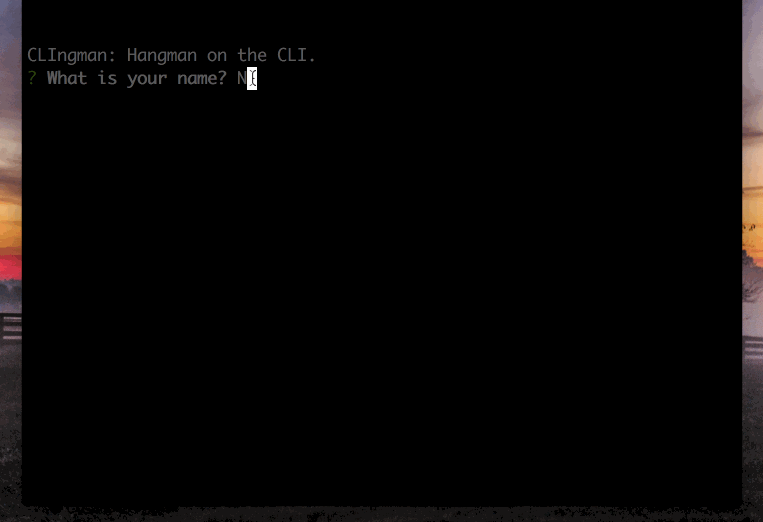

# CLIngman

CLIngman is a hangman game built with NodeJS using constructors.

This is a command line game, so to play the game, you must fork it and run with "npm start".

npm packages used:

* Lodash
* Inquirer
* Is-letter
* Request (used to get words for game creation, not as part of the game)

Demo:
Please note, the demo below includes the word to guess logged to the console in order to speed up the guessing process to keep the demo short.

APIs used: [DataMuse](https://api.datamuse.com/api) to help me come up with scores of words in seconds, which allowed me more time for the logic.
